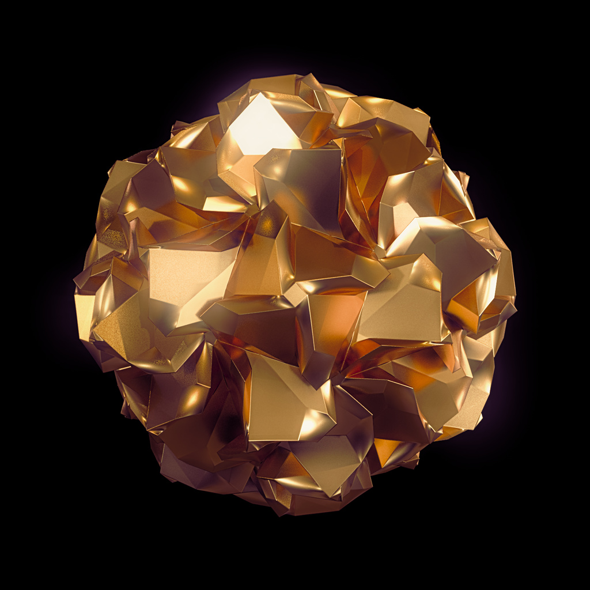
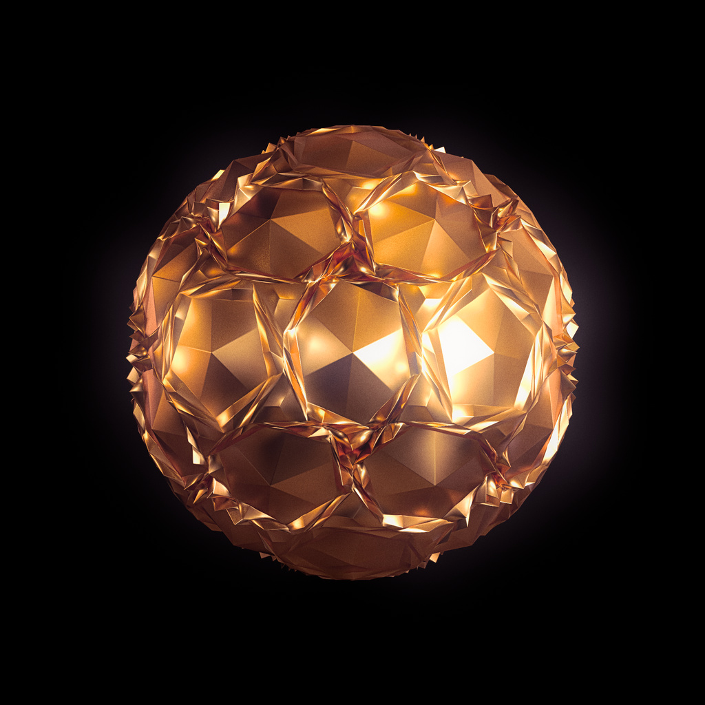

# Polyhedron Operators

This crate implements the [Conway Polyhedron
Operators](http://en.wikipedia.org/wiki/Conway_polyhedron_notation)
and their extensions by [George W. Hart](http://www.georgehart.com/)
and others.



*Some brutalist polyhedron; rendered with
[3Delight|ɴsɪ](https://www.3delight.com) and post processed in
[Darktable](https://www.darktable.org/).*

This is an experiment to improve my understanding of iterators in Rust.
It is based on [Kit Wallace](http://kitwallace.tumblr.com/tagged/conway)’s
OpenSCAD code. As OpenSCAD Language is functional it lends itself
well to translation into functional Rust.

```rust
use polyhedron_ops::Polyhedron;
use std::path::Path;

// Conway notation: gapcD
let polyhedron =
    Polyhedron::dodecahedron()  // D
        .chamfer(None, true)    // c
        .propellor(None, true)  // p
        .ambo(None, true)       // a
        .gyro(None, None, true) // g
        .finalize();

// Export as ./polyhedron-gapcD.obj
polyhedron.write_to_obj(&Path::new("."), false);
```

The above code starts from a
[dodecahedron](https://en.wikipedia.org/wiki/Dodecahedron) and
iteratively applies four operators.

The resulting shape is shown below.



## Caveat

This is in a rough shape. Probably buggy. Documentation sucks.

In short: use at your own risk.

## Cargo Features

* `bevy` – Add support for converting a polyhedron into a
           [`bevy`](https://bevyengine.org/)
           [`Mesh`](https://docs.rs/bevy/latest/bevy/render/mesh/struct.Mesh.html).

* `nsi`  – Adds support for sending a polyhedron to an offline renderer
           via the [ɴsɪ](https://crates.io/crates/nsi/) crate.

* `obj`  – Adds support for writing data out as
           [Wavefront OBJ](https://en.wikipedia.org/wiki/Wavefront_.obj_file).

## Base Shapes

- [x] Platonic solids
- [x] Prisms
- [ ] Antiprisms
- [ ] Pyramids
- [ ] Johnson Solids

## Supported Operators

- [x] **a** - ambo
- [x] **b** - bevel (equiv. to **ta**)
- [x] **c** - chamfer
- [x] **d** - dual
- [x] **e** - expand (a.k.a. explode, equiv. to **aa**)
- [x] **g** - gyro
- [x] **j** - join (equiv. to **dad**)
- [x] **i** - inset
- [x] **M** - medial (equiv. to **dta**)
- [x] **m** - meta (equiv. to **k,,3j**)
- [x] **n** - needle (equiv. to **dt**)
- [x] **o** - ortho (equiv. to **jj**)
- [x] **p** - propellor
- [x] **k** - kis
- [x] **q** - quinto
- [x] **r** - reflect
- [x] **s** - snub (equiv. to **dgd**)
- [x] **t** - truncate vertices (equiv. to *dkNd*)
- [x] **w** - whirl
- [x] **z** - zip (equiv. to **dk**)

### Other Operators (TBD)

- [ ] **i** - inset/loft
- [ ] **h** - hexpropellor
- [ ] **l** - stellate
- [ ] **x** - extrude
- [ ] **z** - triangulate
- [ ] **H** - hollow (called ’intrude‘ in Wings3D)

## Playing

There is a playground example app to test things & have fun:

```
cargo run --release --example playground"
```

If you want to produce images like the ones above you need to
[download the free version of the 3Delight renderer](https://www.3delight.com/download)
and install that. After that, run the example with
[ɴsɪ](https://crates.io/crates/nsi/) support:

```
cargo run --release --example playground --features nsi,obj
```

### Keyboard Commands

Use keys matching the operator name from the above list to apply.

Use `Up` and `Down` to adjust the parameter of the the last operator.
Combine with `Shift` for 10× the change.

`Delete` undoes the last (and only the last) operation.

Press `Enter` to render with 3Delight (requires a [3Delight|ɴsɪ
installation](https://www.3delight.com/download)).
Combine with `Shift` to render with 3Delight Cloud (requires
registration).

Press `Space` to save as `$HOME/polyhedron-<type>.obj`.

I use `kiss3d` for realtime preview which is close to the metal enough
to limit meshes to 64k vertices. This means the preview will be broken
if your mesh hits this limit.

The app may crash though if your graphics driver doesn't handle such
ill-defined meshes gracefully. :)

Export & render will always yield a correct OBJ though. Which you can
view in Wings, Blender or another DCC app.
